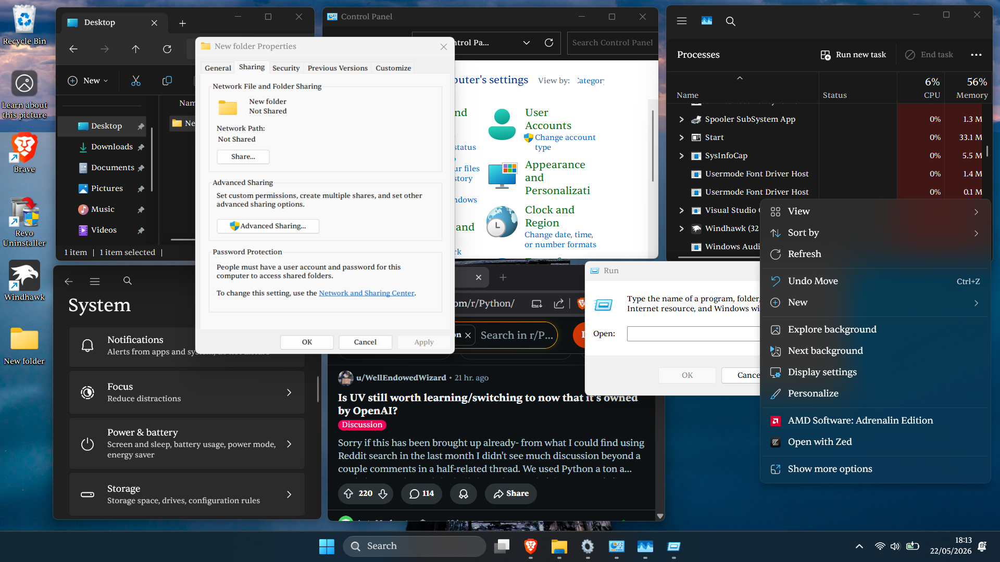
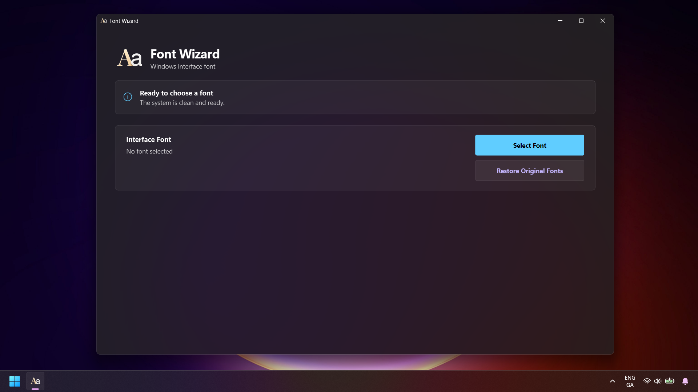
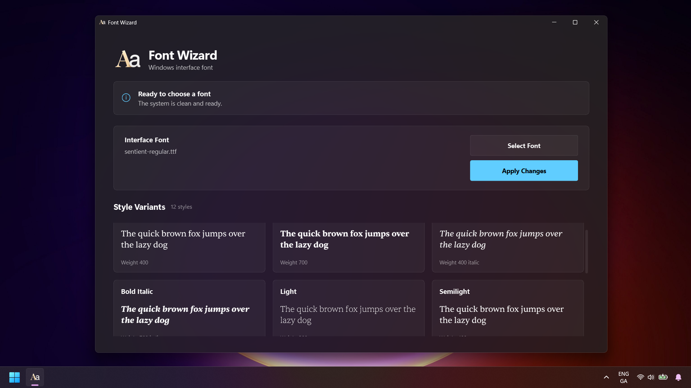
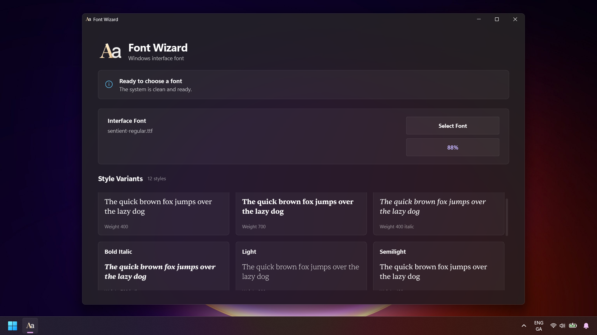
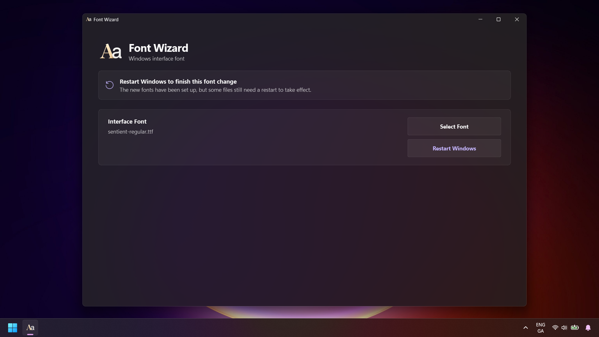

# Font Wizard

Font Wizard is a Windows 11 app for changing the Windows 11 system font across the entire interface including UWP, Win32, WinUI3, Electron, all kinds of apps

## Preview

<p align="center">
  
  <br/><sub>Font applied across Windows</sub>
</p>

<table>
  <tr>
    <td></td>
    <td></td>
  </tr>
  <tr>
    <td align="center"><sub>Launch screen</sub></td>
    <td align="center"><sub>Font selected</sub></td>
  </tr>
  <tr>
    <td></td>
    <td></td>
  </tr>
  <tr>
    <td align="center"><sub>Applying process</sub></td>
    <td align="center"><sub>Waiting for restart</sub></td>
  </tr>
</table>

## Download

Download `Font Wizard App.zip` from the [latest release](../../releases/latest), extract it, and run `Font Wizard.exe`.

## Usage

1. Open Font Wizard on Windows 11.
2. Pick a static `.ttf` font.
3. Preview style variants.
4. Click **Apply Changes**.
5. Restart Windows.

Use **Restore Original Fonts** to go back to the Windows defaults.

Only static TrueType fonts are supported. Variable fonts and `.otf` files are rejected.

## Build

```bat
.\App\build.bat
```

Build output goes to `App\dist\`.

## Built With

- PySide6
- fontTools
  
## Project Status

Font Wizard is fully complete and in maintenance mode. I originally built it to be a commercial product, but decided to open-source it. Future updates will focus strictly on bug fixes, if any.

## License

[MIT](LICENSE)
