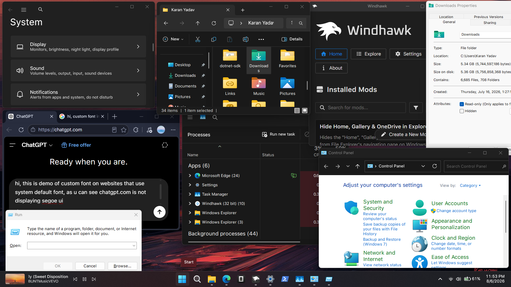
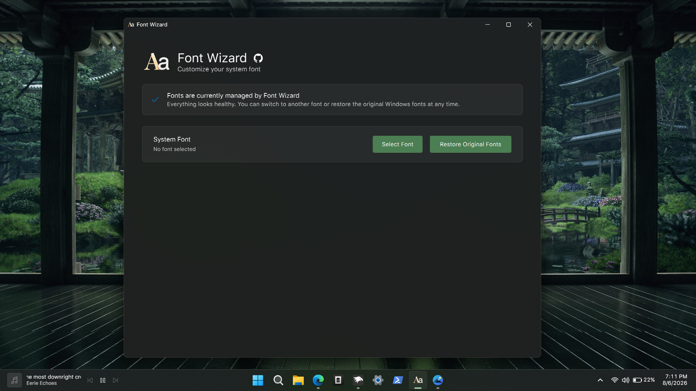
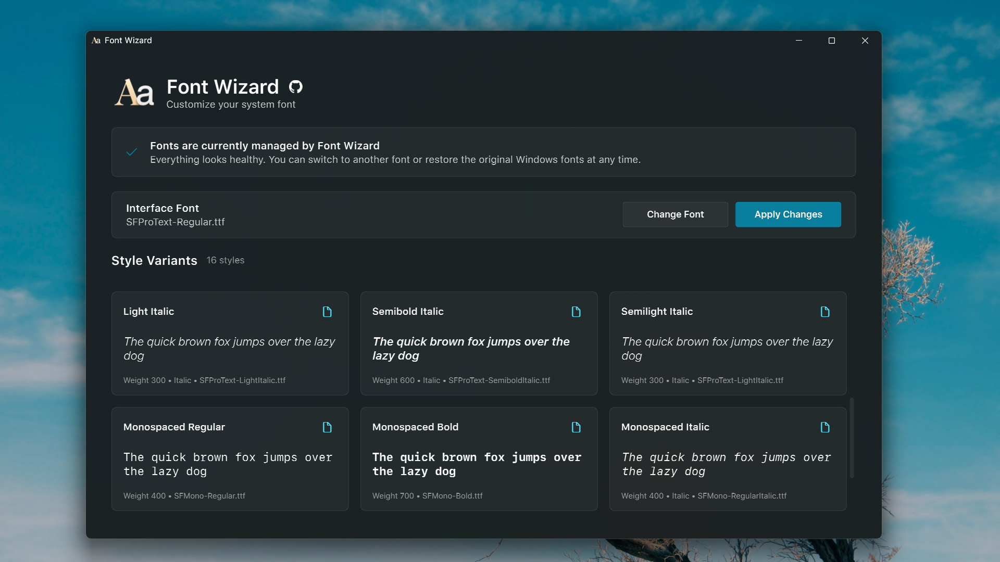
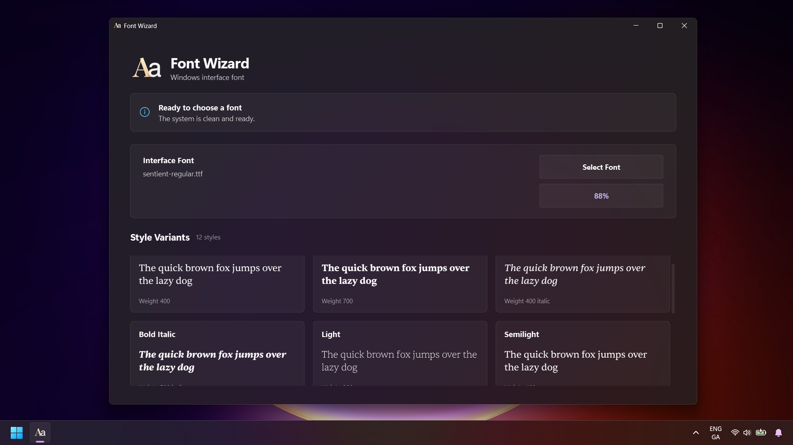
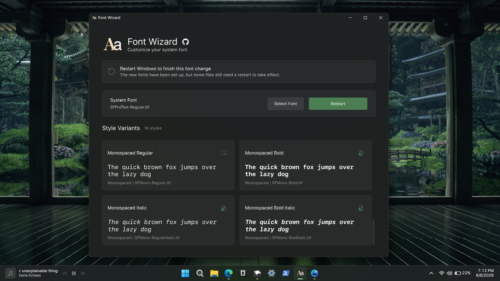

Note: Use Brave browser instead of edge, on some websites some thin text uses default font in edge, everywhere else it still works ,its edge specific issue

# Preview
<p align="center">
  
  <br/><sub>Font applied across Windows</sub>
</p>

# Usage
<table>
  <tr>
    <td></td>
    <td></td>
  </tr>
  <tr>
    <td align="center"><sub>Launch screen</sub></td>
    <td align="center"><sub>Font selected</sub></td>
  </tr>
  <tr>
    <td></td>
    <td></td>
  </tr>
  <tr>
    <td align="center"><sub>Applying process</sub></td>
    <td align="center"><sub>Waiting for restart</sub></td>
  </tr>
</table>

## Download

Download  [latest release](../../releases/latest) and run `FontWizard.exe`.

Only .ttf fonts are supported. Variable fonts and `.otf` files are not supported currently.

## Build

```bat
.\App\build.bat
```

Build output goes to `App\dist\`.

## Built With

- PySide6
- fontTools
  
## Project Status

I originally built it to be a commercial product, but decided to open-source it. Future updates will focus strictly on bug fixes, if any.

## License

[MIT](LICENSE)
