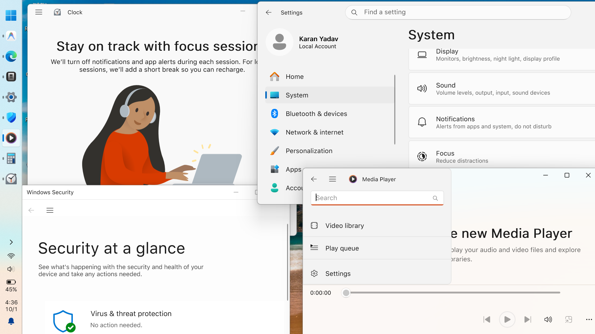
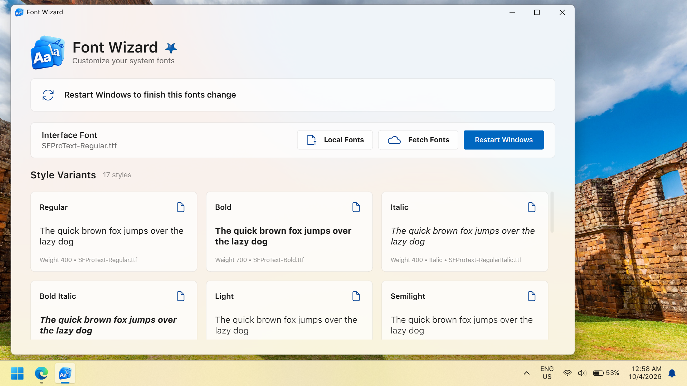
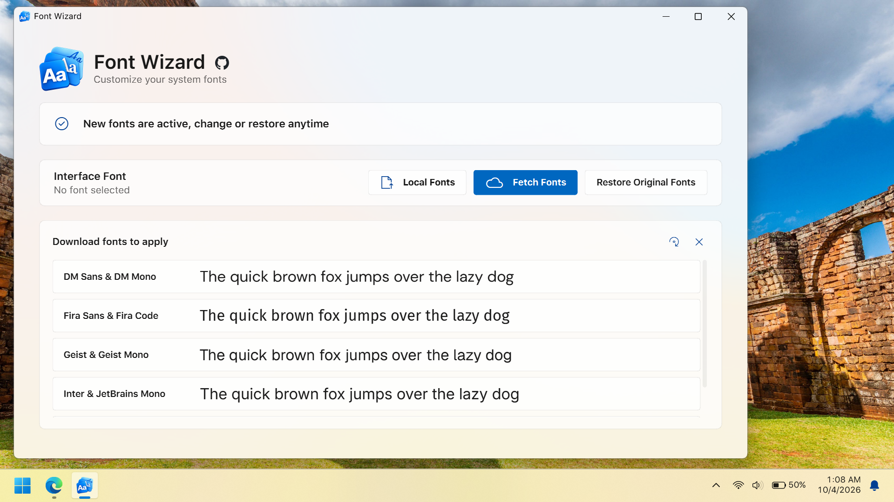

<p align="center">
  
</p>

<h1 align="center"> Font Wizard </h1>

<p align="center">
  <b>Change Windows 11 & 10 system font Everywhere</b>.
</p>


<p align="center"> <b>
⭐ Star the repo, if its useful to you </b>
</p>


---

|Category|Registry Hacks|Winaero Tweaker|Font Wizard|
|-|:-:|:-:|:-:|
|**Old Win32 Apps** (Control Panel, etc)|✅|✅|✅|
|**Modern apps (WinUI, UWP)**|❌|❌|✅|
|**System Shell, settings, explorer, etc**|❌|❌|✅|
|**Electron \& Chromium Apps** (VS Code, Whatsapp, Discord, etc)|❌|❌|✅|
|**System Icons \& Glyph Preservation**|⚠️|⚠️|✅|
|**1-Click Revert to Original fonts (Segoe UI)**|❌|⚠️|✅|
---
## 📥 Download 
> Download latest release [**here**](https://github.com/karnyadavdev/fontwizard/releases/latest)


### Install from Microsoft servers

```powershell
winget install -e --id karnyadavdev.FontWizard
```


## 📸 Screenshots


<p align="center">
  
</p>

<p align="center">
  
</p>
<p align="center">
  
</p>

<p align="center">
  
</p>

<p align="center">
  
</p>

<p align="center">
  
</p>


---

---

## Build from Source


```bat
.\App\build.bat
```

Build output goes to `App\dist\`.
